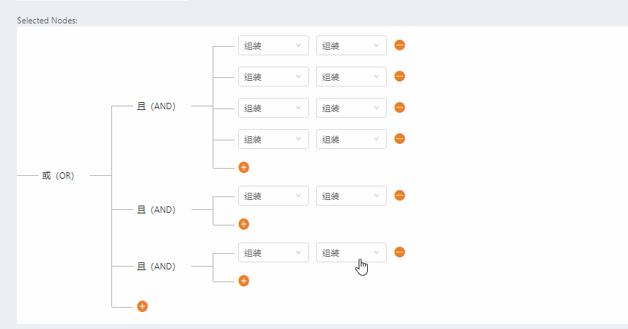

# primeng-ext
primeng component extension

## Table of Contents
* **[1. Calendar](#1---calendar)**
* **[2. Autocomplete](#1---autocomplete)**
* **[3. Tabview](#1---tabview)**
* **[4. Tree](#1---tree)**

---

## Component

### Calendar

- showTime="true"


**[⬆ back to top](#table-of-contents)**

### Autocomplete

-  hasChildren="hasChildren"

```html
  <p-autoComplete #pac name="text"
                    [(ngModel)]="value"
                    hasChildren="hasChildren"
                    [suggestions]="options"
                    (completeMethod)="queryData($event)"
                    field="name"
                    [inputStyle]="{'width':width}"
                    [style]="{'width':width}"></p-autoComplete>

```


**[⬆ back to top](#table-of-contents)**

### Tabview

lazyLoad component without router

```html

<ui-tabview #tabview [tabs]="tabs" [activeIndex]="tabActiveIndex"
                    (tabClose)="handlerTabClose($event)"></ui-tabview>
                    
```


**[⬆ back to top](#table-of-contents)**

### Tree

demo 样式基于`ng-zorro-antd`

```html

 <p-tree [value]="filesTree11" layout="horizontal" selectionMode="single" [(selection)]="selectedFile3" [border]="false" [canCollapsed]="false">
        <ng-template let-node pTemplate="edit">
            <div style="float: left;">
                <nz-select [(ngModel)]="installType" [nzPlaceHolder]="''" name="installType" style="width:100px;">
                    <nz-option [nzLabel]="'整装'" [nzValue]="'fullInstall'"></nz-option>
                    <nz-option [nzLabel]="'组装'" [nzValue]="'assembleInstall'"></nz-option>
                </nz-select>
            </div>
            <div style="float: left;" class="margin-left-10">
                <nz-select [(ngModel)]="installType" [nzPlaceHolder]="''" name="installType" style="width:100px;">
                    <nz-option [nzLabel]="'整装'" [nzValue]="'fullInstall'"></nz-option>
                    <nz-option [nzLabel]="'组装'" [nzValue]="'assembleInstall'"></nz-option>
                </nz-select>
            </div>
            <div style="float: left;" class="margin-left-10 margin-top-5">
                <i class="anticon anticon-minus-circle" (click)="minusRule(node)" style="font-size: 15px;" title="移除条件"></i>
            </div>
        </ng-template>
        <ng-template let-node pTemplate="add">
            <i class="anticon anticon-plus-circle" (click)="addRule(node)" style="font-size: 15px;" title="添加条件"></i>
        </ng-template>
    </p-tree>
                    
```

数据结构`filesTree11`

```json
{
    "data": [{
        "id": "aaaaaa",
        "label": "或（OR）",
        "condition": "or",
        "data": "or",
        "children": [{
                "id": "xxxxx",
                "parentId": "aaaaaa",
                "label": "且（AND）",
                "condition": "and",
                "data": "and",
                "children": [{
                        "id": "xxxxxxx1",
                        "parentId": "xxxxx",
                        "label": "Expenses.doc",
                        "data": "Expenses Document"
                    },
                    {
                        "id": "xxxxx2",
                        "parentId": "xxxxx",
                        "label": "Resume.doc",
                        "data": "Resume Document"
                    }, {
                        "id": "xxxxx3",
                        "parentId": "xxxxx",
                        "label": "",
                        "type": "add"
                    }
                ]
            },
            {
                "id": "dddddd",
                "parentId": "aaaaaa",
                "label": "且（AND）",
                "condition": "and",
                "data": "and",
                "children": [{
                    "id": "dddddd1",
                    "parentId": "dddddd",
                    "label": "Invoices.txt",
                    "data": "Invoices for this month"
                }, {
                    "id": "dddddd2",
                    "parentId": "dddddd",
                    "label": "",
                    "type": "add"
                }]
            },
            {
                "id": "aaaaaa1",
                "parentId": "aaaaaa",
                "label": "",
                "type": "add"
            }
        ]
    }]
}

```

绑定方法`addRule` & `minusRule`

```ts

addRule(node) {
    let parId = node.parentId;
    let parNode = this.getParentNode(parId);
    if (!parNode) {
      return this.msg.error('无法获取父节点！');
    }
    let len = parNode.children.length;
    let id = new Date().getTime();
    let newNode: any = {
      "id": parId + '' + id,
      "parentId": parId,
      "type": "edit",
      "label": "new" + len,
      "data": "Resume Document"
    };

    if (parNode.condition === 'or') {
      newNode.parentId = id;
      parNode.children.splice(len - 1, 0, {
        "id": id,
        "parentId": parId,
        "label": "且（AND）",
        "expanded": true,
        "condition": "and",
        "data": "and",
        "children": [newNode,
          {
            "parentId": id,
            "label": "",
            "type": "add"
          }]
      });

    } else {
      parNode.children.splice(len - 1, 0, newNode);
    }
  }
  /**删除条件 */
  minusRule(node) {
    if (node.parentId) {
      let parNode = this.getParentNode(node.parentId);
      if (parNode.children.length === 2) {
        parNode.children = [];
        this.minusRule(parNode);
      } else {
        parNode.children = parNode.children.filter(n => n.id !== node.id);
      }
    } else {
      this.filesTree11 = this.filesTree11.filter(n => n.id !== node.id);
    }
  }


```

上边代码效果图：



额外支持场景：


**[⬆ back to top](#table-of-contents)**

## [License](./LICENSE)

---

> [giscafer.com](http://giscafer.com) &nbsp;&middot;&nbsp;
> GitHub [@giscafer](https://github.com/giscafer) &nbsp;&middot;&nbsp;
> Weibo [@Nickbing Lao](https://weibo.com/laohoubin) &nbsp;&middot;&nbsp;
> Twitter [@nickbinglao](https://twitter.com/nickbinglao)
